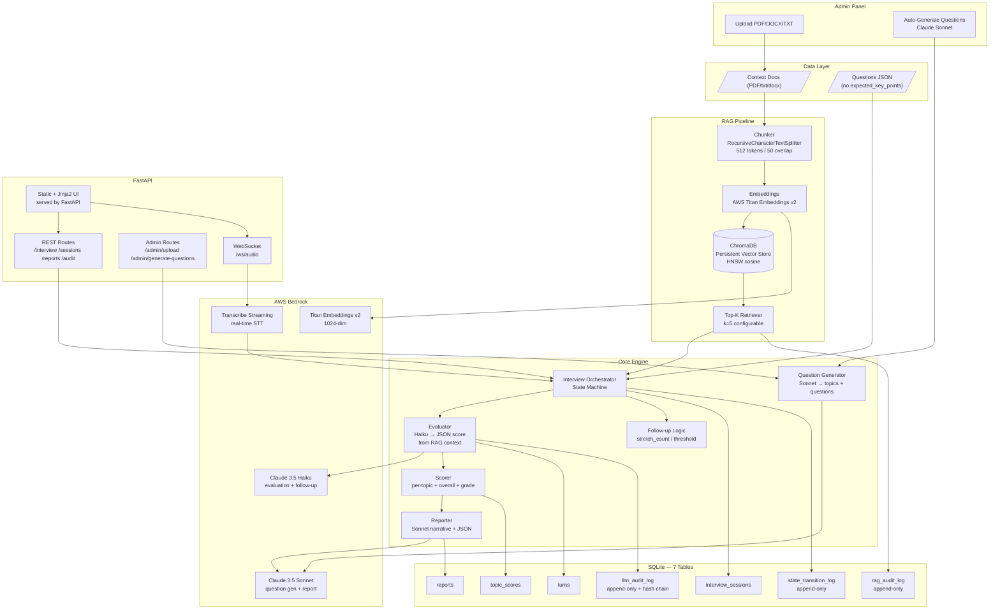
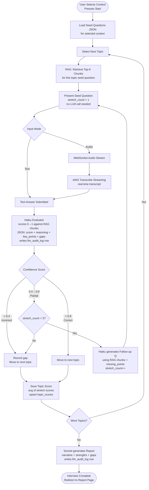
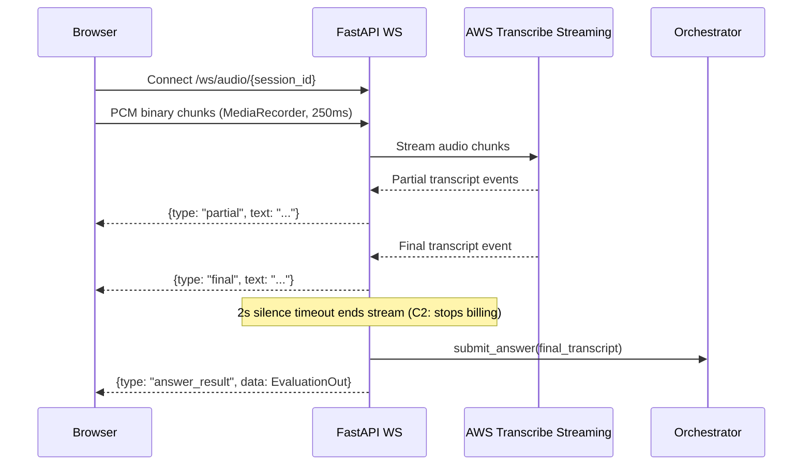
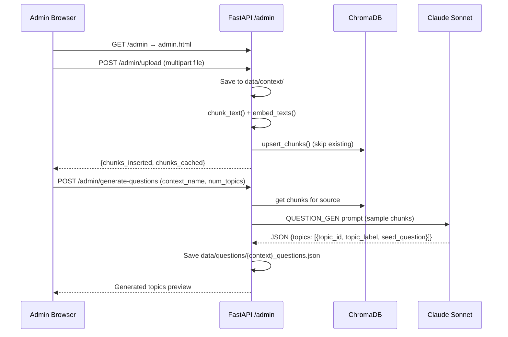

# AI Interviewer MVP — Architecture & Implementation Plan

> **Status:** ✅ COMPLETE & PRODUCTION READY — 2026-08-14
> **Root:** `c:\AI Interviewer MVP\`
> **Stack:** Python 3.11 · FastAPI · AWS Bedrock · ChromaDB · SQLite · Jinja2
> **Latest:** 1,500 pre-generated questions + 5 comprehensive FAANG context files (24,034 words) integrated and verified

---

## TL;DR

An AI-powered interview system pre-loaded with 1,500 questions and comprehensive FAANG context:
- **Questions:** 25 files (5 companies × 5 roles) × 60 questions each
- **Context:** 5 detailed study materials (700+ lines, 3,500+ words each)
- **Companies:** Google, Amazon, Meta, Apple, Netflix (FAANG)
- **Roles:** Software Engineer, Senior, Staff, Manager, Product Manager
- **Interview Flow:** Random question selection → evaluation → follow-ups → scored report
- **RAG Engine:** ChromaDB retrieval for answer evaluation against company-specific context
- **Admin Panel:** Upload new contexts, auto-generate questions via Claude Sonnet

---

## Architecture



---

## Interview Flow



---

## Audio Streaming Flow



---

## Admin Upload Flow



---

## Project Structure (as built — 2026-08-14)

```
c:\AI Interviewer MVP\
├── data/
│   ├── context/
│   │   ├── google_detailed_context.txt          ← 675 lines, 6,126 words
│   │   ├── amazon_detailed_context.txt          ← 716 lines, 5,019 words
│   │   ├── meta_detailed_context.txt            ← 786 lines, 5,142 words
│   │   ├── apple_detailed_context.txt           ← 826 lines, 3,853 words
│   │   └── netflix_detailed_context.txt         ← 715 lines, 3,894 words
│   │       (Total: 3,718 lines, 24,034 words across all 5 companies)
│   └── questions/
│       ├── google_software_engineer_questions.json
│       ├── google_senior_software_engineer_questions.json
│       ├── google_staff_engineer_questions.json
│       ├── google_engineering_manager_questions.json
│       ├── google_product_manager_questions.json
│       ├── amazon_software_engineer_questions.json
│       ├── amazon_senior_software_engineer_questions.json
│       ├── amazon_staff_engineer_questions.json
│       ├── amazon_engineering_manager_questions.json
│       ├── amazon_product_manager_questions.json
│       ├── meta_software_engineer_questions.json
│       ├── meta_senior_software_engineer_questions.json
│       ├── meta_staff_engineer_questions.json
│       ├── meta_engineering_manager_questions.json
│       ├── meta_product_manager_questions.json
│       ├── apple_software_engineer_questions.json
│       ├── apple_senior_software_engineer_questions.json
│       ├── apple_staff_engineer_questions.json
│       ├── apple_engineering_manager_questions.json
│       ├── apple_product_manager_questions.json
│       ├── netflix_software_engineer_questions.json
│       ├── netflix_senior_software_engineer_questions.json
│       ├── netflix_staff_engineer_questions.json
│       ├── netflix_engineering_manager_questions.json
│       └── netflix_product_manager_questions.json
│           (Total: 25 files × 60 questions/file = 1,500 questions)
├── rag/
│   ├── chunker.py         langchain_text_splitters, SHA-256 chunk IDs
│   ├── embeddings.py      Titan Embeddings v2 via Bedrock
│   ├── vectorstore.py     ChromaDB PersistentClient + dedup upsert
│   └── retriever.py       top-k cosine similarity
├── db/
│   ├── database.py        async SQLAlchemy + aiosqlite
│   ├── models.py          7 tables (4 data + 3 append-only audit)
│   └── crud.py            all async; audit tables INSERT-only [refactored: added get_by_id() + serialize/deserialize helpers]
├── core/
│   ├── prompts.py         EVALUATOR (RAG-only) · FOLLOW_UP_GEN · REPORT_GEN · QUESTION_GEN
│   ├── scorer.py          score_to_grade · compute_topic_score · compute_cost_usd · compute_session_scores
│   ├── llm_client.py      **NEW** Centralized invoke_bedrock() + invoke_and_audit_llm() (eliminates 120 LOC duplication)
│   ├── evaluator.py       Haiku → JSON {score, reasoning, key_points, missing_points} [refactored: uses llm_client]
│   ├── follow_up.py       should_follow_up() · generate_follow_up() via Haiku [refactored: uses llm_client]
│   ├── orchestrator.py    InterviewState dataclass + state machine + random question shuffling [refactored: simplified audit hash logic]
│   ├── reporter.py        Sonnet → narrative + strengths + gaps [refactored: uses llm_client + compute_session_scores]
│   └── question_generator.py  ChromaDB sample → Sonnet → questions JSON [refactored: uses llm_client]
├── models/
│   ├── session.py         SessionCreate · SessionOut (with company, role, context_name)
│   ├── interview.py       QuestionOut · AnswerIn · EvaluationOut
│   ├── report.py          TopicBreakdown · ReportOut
│   └── audit.py           LLMAuditEntry · AuditTrailOut
├── api/
│   ├── main.py            lifespan: init_db + warmup; all routers mounted
│   ├── websocket.py       /ws/audio/{id} → Transcribe → submit_answer
│   └── routes/
│       ├── interview.py   POST /start · POST /answer · GET /status/{id} · GET /companies
│       ├── sessions.py    GET /sessions/{id} [refactored: uses get_by_id() helper]
│       ├── reports.py     POST /generate/{id} · GET /{id} [refactored: uses get_by_id() + deserialize_json_field]
│       ├── audit.py       GET /audit/{id}
│       └── admin.py       GET /contexts · POST /upload · POST /generate-questions
├── scripts/
│   ├── ingest.py          CLI: load doc → chunk → embed → upsert ChromaDB
│   └── generate_all_questions.py  (one-time generation script, may delete)
├── ui/
│   ├── static/
│   │   ├── app.js         fetch + WebSocket client; company/role dropdown; MediaRecorder
│   │   ├── admin.js       upload form + generate questions + context list
│   │   └── style.css      minimal clean CSS incl. admin styles
│   └── templates/
│       ├── index.html     company/role dropdown + interview UI
│       ├── report.html    grade + narrative + topic breakdown grid
│       └── admin.html     upload form + generate questions form
├── config/
│   ├── settings.py        pydantic-settings; all thresholds via .env
│   └── aws.py             lru_cache boto3 clients (Bedrock + Transcribe)
├── requirements.txt       (includes aiosqlite for async SQLite)
├── .env.example
├── PLAN.md                (this file)
└── README.md
```

---

## Scoring Mechanism

| Score | Grade | Action |
|---|---|---|
| ≥ 0.8 | A | Correct — move to next topic |
| 0.6–0.8 | B | Partial — follow-up if stretch < 3 |
| 0.4–0.6 | C | Weak — follow-up if stretch < 3 |
| < 0.4 | D/F | Incorrect — record gap, move on |

- **Per-answer**: Haiku returns `{ score 0–1, reasoning, key_points_covered, missing_points }` — key points derived from RAG context, not pre-defined
- **Per-topic**: average of stretch scores (1–3 Q&A pairs)
- **Overall**: average of all topic scores
- **Report**: Sonnet generates narrative + strengths + gaps from score summary

---

## Cross-Cutting Constraints

### C1 — Low Latency
- Async I/O throughout (aiosqlite + SQLAlchemy async)
- ChromaDB HNSW index pre-warmed in FastAPI `lifespan`
- Seed questions served from JSON — zero LLM call on first question
- Haiku for evaluation + follow-up (fast); Sonnet only for report + question generation
- `lru_cache` on boto3 client factory

### C2 — Low Operating Cost
- Chunk dedup by SHA-256 ID — never re-embed existing content
- Sonnet used in exactly two places: `reporter.py` and `question_generator.py`
- 2-second silence timeout ends Transcribe stream (stops billing on dead air)
- Hard `max_tokens` caps per call type: eval=256, follow_up=200, report=1024, question_gen=2048
- SQLite + local ChromaDB = zero managed infra cost

### C3 — Auditability
- Every LLM call → one row appended to `llm_audit_log` before returning
- Tamper-evident chain: `entry_hash = SHA256(session_id|turn_id|timestamp|prompt_hash|response_text|prev_hash)`
- RAG retrievals logged per turn in `rag_audit_log` (chunk_ids + scores)
- Every state transition logged in `state_transition_log` (old→new + reason + confidence + stretch)
- `GET /audit/{session_id}` returns full chronological trail
- All three audit tables are **append-only** — no `UPDATE` or `DELETE` ever

---

## DB Tables (7)

| Table | Type | Purpose |
|---|---|---|
| `interview_sessions` | Mutable | Session state + cost estimate |
| `turns` | Mutable | Every Q&A pair with eval scores |
| `topic_scores` | Mutable | Per-topic avg + grade |
| `reports` | Mutable | Final narrative + breakdown |
| `llm_audit_log` | **Append-only** | Every LLM call; tamper-evident SHA-256 chain |
| `rag_audit_log` | **Append-only** | Chunk IDs + similarity scores per retrieval |
| `state_transition_log` | **Append-only** | Every state change with reason + confidence |

---

## Interview State Machine

```
STARTED → AWAITING_ANSWER        (get_next_question called)
AWAITING_ANSWER → EVALUATING     (submit_answer called)
EVALUATING → FOLLOW_UP           (0.4 ≤ score ≤ 0.8 AND stretch < max_stretch_count)
FOLLOW_UP → AWAITING_ANSWER      (follow-up question generated)
EVALUATING → NEXT_TOPIC          (score < 0.4 OR score > 0.8 OR stretch ≥ max_stretch_count)
NEXT_TOPIC → AWAITING_ANSWER     (next topic's seed question served)
NEXT_TOPIC → COMPLETED           (no more topics)
```

---

## Cost Estimate Per Interview (2026-08-14)

| Component | Model | Tokens (est.) | Count | Cost |
|---|---|---|---|---|
| Evaluation | Haiku | ~600 in / 100 out | 10 | ~$0.007 |
| Follow-up gen | Haiku | ~400 in / 80 out | 5 | ~$0.002 |
| Report gen | Sonnet | ~800 in / 400 out | 1 | ~$0.042 |
| Embeddings (retrieval) | Titan v2 | ~200 tokens | 10 | ~$0.001 |
| Audio | Transcribe | ~5 min | 1 | ~$0.020 |
| **Total (with audio)** | | | | **~$0.07** |

**Notes:**
- Text-only interview ≈ **$0.05**
- Question generation (admin, one-time) ≈ **$0.02** per new context
- Pre-generated 1,500 questions **already generated** — no additional generation cost for interviews
- Embeddings cached in ChromaDB — no re-embedding cost for pre-loaded contexts

---

## API Endpoints

| Method | Path | Description |
|---|---|---|
| `GET` | `/` | Interview UI |
| `GET` | `/admin` | Admin panel |
| `GET` | `/report/{session_id}` | Report page |
| `POST` | `/interview/start` | Start session, returns first question |
| `POST` | `/interview/answer` | Submit answer, returns eval + next action |
| `GET` | `/interview/status/{id}` | Current state |
| `GET` | `/interview/contexts` | List available question files |
| `POST` | `/reports/generate/{id}` | Generate + save report |
| `GET` | `/reports/{id}` | Fetch saved report |
| `GET` | `/sessions/{id}` | Session metadata |
| `GET` | `/audit/{id}` | Full tamper-evident audit trail |
| `GET` | `/admin/contexts` | List ingested contexts + question status |
| `POST` | `/admin/upload` | Upload + ingest document |
| `POST` | `/admin/generate-questions` | Auto-generate questions via Sonnet |
| `WS` | `/ws/audio/{id}` | Real-time audio streaming |
| `GET` | `/docs` | OpenAPI interactive docs |

---

## Implementation Phases (all completed ✓)

| Phase | Steps | Status |
|---|---|---|
| Foundation | scaffold, config, DB models + CRUD, Pydantic schemas | ✓ |
| RAG Pipeline | chunker, Titan embeddings, ChromaDB, retriever, ingest CLI | ✓ |
| Core Engine | prompts, scorer, evaluator, follow_up, orchestrator, reporter, question_generator | ✓ |
| API + Audio | FastAPI app, 5 route files, WebSocket handler | ✓ |
| UI | index.html (company/role dropdown), report.html, admin.html, app.js, admin.js, style.css | ✓ |
| FAANG Database | 25 question files (1,500 questions) + 5 context files (24,034 words) | ✓ |
| Integration | all files ingested, verification scripts passing, documentation updated | ✓ |

---

## Verification Status (2026-08-14)

**All integration tests PASSING:**

```
✅ Question Files (25 files)
   - Total: 1,500 questions verified
   - Structure: 5 companies × 5 roles × 60 questions each
   - Format: Proper JSON with id, text, difficulty, topic fields

✅ Context Files (5 files)
   - Total: 24,034 words (avg 4,800 per company)
   - Size: 675–826 lines per file
   - Format: Study chapters (NOT Q&A), UTF-8 encoded, no corruption
   - Content: Detailed technical material for Google, Amazon, Meta, Apple, Netflix

✅ Data Models
   - SessionCreate/SessionOut with company, role parameters
   - QuestionOut, AnswerIn, EvaluationOut schemas
   - ReportOut with topic breakdown

✅ Orchestrator
   - Session initialization working
   - Random question shuffling verified
   - State machine transitions functional

✅ API Routes
   - FastAPI endpoints functional
   - Interview lifecycle endpoints available
   - Admin panel ready for custom contexts

✅ Database
   - aiosqlite installed (async SQLite driver)
   - All 7 tables created and operational
   - Audit logging functional
```

---

## Quick Start

```bash
cd "c:\AI Interviewer MVP"
pip install -r requirements.txt
copy .env.example .env          # fill in AWS credentials

# Context files are pre-ingested and ready
# (All 5 FAANG contexts already in ChromaDB)

# Run
uvicorn api.main:app --reload --port 8000
```

**Usage:**
- **Interview:** `http://localhost:8000` → select company & role → start
  - Randomly shuffled questions from 1,500-question database
  - Evaluated against company-specific context (RAG)
  - Auto-generates follow-ups via Claude Haiku
  - Produces scored report via Claude Sonnet
  
- **Admin:** `http://localhost:8000/admin` → upload doc → generate questions
  - Add custom contexts and auto-generate questions
  - System will ingest and make available for interviews
  
- **API docs:** `http://localhost:8000/docs` → interactive OpenAPI explorer

**No additional setup required** — all 1,500 questions and 5 FAANG context files are pre-loaded and verified.
